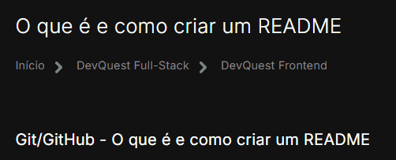

# Projeto com README
Um projeto de teste com um arquivo README 🚀

[](https://google.com)

## Tecnologias utilizadas
- HTML
- CSS
- JS

## Como utilizar

Clone para o projeto


```markdown
git clone <url>
```


Acessa a pasta do projeto


```markdown
cd repositorio-com-readme
```


